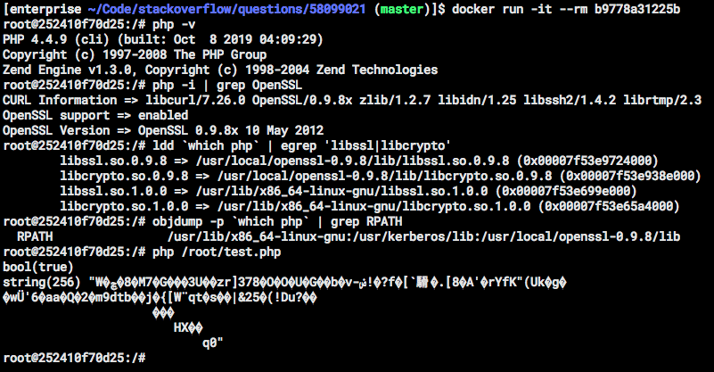

# Question

## [compiling outdated PHP yields core dump with OpenSSL functions. OpenSSL version mismatch?](https://stackoverflow.com/q/58099021/157675)

I compiled OpenSSL 0.9.8x with these ./config options:

    ./config --prefix=/usr/local/openssl-0.9.8 --openssldir=/usr/local/openssl-0.9.8

I'm compiling my PHP version with these ./configure options (among others):

       --with-openssl=/usr/local/openssl-0.9.8
       --with-openssl-dir=/usr/local/openssl-0.9.8

The problem is that when I run a PHP script with `openssl_public_encrypt` I'm getting a segmentation fault.

Here's what gdb says:

    Program terminated with signal 11, Segmentation fault.
    #0  0x00007fd3381c5a48 in RSA_public_encrypt () from /usr/lib/x86_64-linux-gnu/libcrypto.so.1.0.0

In /usr/local/openssl-0.9.8/lib/ there's libcrypto.so.0.9.8 so why isn't it using that?

Here's my OpenSSL Makefile:

https://pastebin.com/0QSqLCr8

Here's my PHP Makefile:

https://pastebin.com/dGmu0SYZ

Here's a Dockefile that reproduces the issue:

https://pastebin.com/ziZzvTh8

Any ideas? Thanks!

# My answer

See https://stackoverflow.com/a/58280319/157675

## Related files

- [ziZzvTh8.txt](ziZzvTh8.txt)

  Fetch from https://pastebin.com/ziZzvTh8

- [Dockerfile](Dockerfile) 

    Modified dockerfile to resolve segfault for question

- [test.php](test.php)

    Simple PHP script contains `openssl_public_encryplt` call to reproduce the issue.

